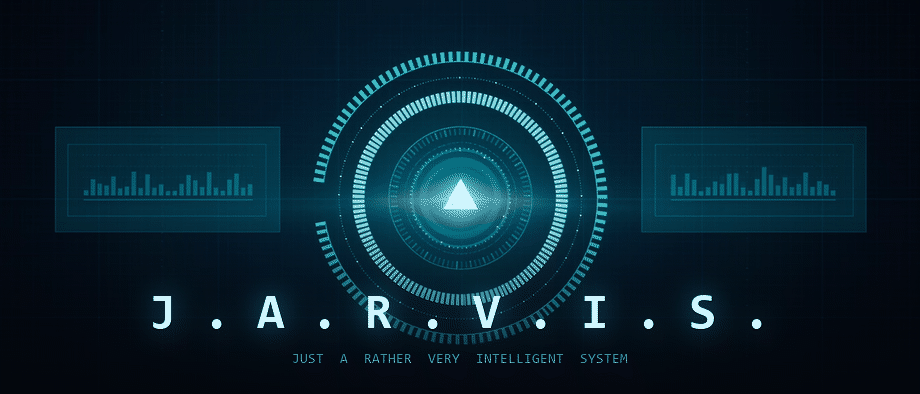

<div align="center">



A local AI assistant with real control over your computer, wrapped in a holographic HUD.
Powered by Google Gemini. Runs entirely on your machine.

</div>

---

## What this is

An AI that actually *does* things on your computer rather than telling you how to do them.
Ask it to find a file, kill the process eating your CPU, read the error on your screen, or
build you a project — and it goes and does it.

It talks like JARVIS does in the films: British, precise, dry, and it will tell you when
your plan is a bad one before it carries it out anyway.

**A real Windows application.** Frameless Win32 window, its own taskbar entry and icon, its
own process, a system tray icon — no browser, no address bar, no visible port. Rendering is
Edge WebView2, the same architecture VS Code, Discord and Teams use.

**No server, no port.** The native window serves the HUD from an internal virtual host and
talks to Python in-process — nothing binds a socket, so `netstat` shows nothing and there is
no loopback origin to see. The only thing that ever leaves your machine is the conversation
you send to Google's Gemini API using your own key.

## Features

**Sees your machine** — live CPU, memory, disk, battery and network telemetry streaming into
the HUD; process inspection; hardware and network detail on request.

**Sees your screen** — genuine vision. Ask "what's this error?" or "what am I looking at" and
it takes a screenshot and reads it.

**Controls your machine** — files (read, write, edit, search, move, recycle), applications and
windows, PowerShell and cmd, Python execution, keyboard and mouse, clipboard, volume.

**Delegates to Claude Code** — for real software work it hands the job to
[Claude Code](https://claude.com/claude-code), waits, and reports back. It can also open an
interactive Claude session in its own terminal for you to drive, or ask read-only questions
about a codebase.

**Reaches the web** — search, page retrieval, weather.

**Remembers** — a local SQLite store of facts it decides are worth keeping, plus conversation
history. It curates this itself; tell it something true about you and it will keep it.

**Speaks properly** — a real neural British voice (`en-GB-RyanNeural`), not the flat robotic
one Windows ships with. No API key, no account, no extra download. 47 voices to choose from
in Settings, and it falls back to your system voices automatically if you're offline.

**Answers to its name** — turn on always-listening and say **"hey JARVIS"**. It ignores
everything else it hears, chimes when the wake word lands, and will not answer its own voice.
Say the wake word alone and it waits eight seconds for your instruction.

**Sees through your camera** — "hey JARVIS, take a look at this" and it looks through your
webcam. Hold something up and ask what it is, or what a label says. The capture is shown in
the transcript so you always see exactly what was sent.

**Knows your face** — enrol once and JARVIS recognises you through the webcam. Turn on face
approval and confirmations complete themselves when it sees it's you, with a manual prompt as
the fallback when it doesn't. Runs entirely on-device (YuNet + SFace); no image is ever stored
or sent anywhere.

**Asks before it acts** — see [Security](#security) below. This is the part worth reading.

---

## Quick start

### Windows — the easy way

1. Download **`JARVIS.exe`** from [Releases](../../releases).
2. Put it in a folder you can write to (**not** Program Files — it keeps its settings and
   memory beside itself).
3. Double-click it.

No Python, no install, no dependencies. About 27 MB, starts in a couple of seconds.

### Windows — from source

1. Install [Python 3.10+](https://python.org) — tick **Add Python to PATH** during setup.
2. Download this repository (green **Code** button → **Download ZIP**, then extract).
3. Double-click **`start.bat`**.

The first run builds a virtual environment and installs dependencies, which takes a minute.

### Either way — the API key

On first launch it asks for a Gemini API key:

1. Go to **[aistudio.google.com/apikey](https://aistudio.google.com/apikey)**
2. Sign in and click **Create API key** — the free tier is plenty
3. Paste it in. It's validated against Google before it's saved.

The key is written to `data/settings.json` on your machine and is git-ignored. It is never
sent anywhere except Google's API.

### macOS / Linux

Most of it works; the Windows-specific tools (PowerShell, Explorer, volume, Recycle Bin)
degrade gracefully with a clear message.

```bash
python3 -m venv .venv && source .venv/bin/activate
pip install -r requirements.txt
python -m jarvis
```

### Commands

```bash
python -m jarvis            # open the desktop app
python -m jarvis serve      # server only, no window
python -m jarvis browser    # open in your default browser
python -m jarvis doctor     # check the installation
python -m jarvis models     # list Gemini models available on your key
python -m jarvis key KEY    # store an API key from the command line
```

---

## Security

Giving an AI shell access to your computer is a genuinely risky thing to do. This project
takes that seriously rather than hand-waving it.

### Three authority levels

Switch between them from the HUD at any time.

| Level | What it means |
|---|---|
| **Observe** | May read anything. Cannot write, execute, or control input. Nothing changes. |
| **Guarded** *(default)* | Safe tools run freely. Every write, command and input action stops and asks you first, showing the exact operation and arguments. |
| **Autonomy** | Acts without asking. For when you're watching and want speed. |

### The blocklist is absolute

A set of patterns in `config.yaml` is refused in **every** mode, including Autonomy, and
cannot be disabled from the Settings panel: disk formatting, recursive deletion of system
roots, `diskpart`, `bcdedit`, shadow-copy deletion, `HKLM` registry deletion, shutdown
commands, and `curl … | sh` pipe-to-shell patterns.

Protected directories (`C:\Windows`, `Program Files`, `ProgramData` by default, editable in
Settings) reject all writes and deletions regardless of mode.

Deletion goes to the **Recycle Bin**, never a hard delete. Overwriting a file leaves a
`.jarvis-bak` copy beside it.

### Prompt injection

Content JARVIS reads through tools — web pages, files, command output, screenshots — is
treated as information, never as instructions. If a page or file contains text addressed to
the AI telling it to take an action, it is instructed to quote it to you and ask rather than
act on it.

### Face approval is convenience, not security

Enrolling your face lets confirmations complete without a click when JARVIS recognises you.
Understand exactly what that is and is not:

- It is a **presence check**. A photograph or a video on a phone can defeat it. There is no
  liveness detection and no anti-spoofing.
- Windows Hello with an infrared camera is the secure version of this. If your machine has
  that hardware, prefer it.
- It is **off by default**, and it only ever *grants* approval — it never blocks you. If the
  camera fails or the face doesn't match, the normal dialog appears.
- The blocklist and protected paths are unaffected by it. Those remain the real protection.

Measured separation on this implementation: a genuine match scores 0.99–1.00, a different
person scores 0.18, against a 0.363 threshold.

### What this does not protect you from

Guarded mode is only as good as your reading of the confirmation dialog. If you click
**AUTHORISE** on a command without reading it, that's on you. In Autonomy mode there is no
dialog at all. Treat Autonomy the way you'd treat handing someone your unlocked laptop.

---

## Settings

Everything is configurable from the gear icon in the top right. Nothing is hardcoded.

| Tab | Contains |
|---|---|
| **API** | Gemini key (with a live test button), model, temperature, output length, tool-step ceiling |
| **Persona** | Name, what it calls you, the wit dial (0–10), memory behaviour |
| **Security** | Default authority level, protected paths, shell timeout, output caps |
| **Voice** | Engine (neural or system), voice picker, rate, pitch, always-listening, wake word, chime |
| **Interface** | Accent colours, boot sequence, telemetry rate, window mode, port |

Settings persist to `data/settings.json`, which is git-ignored. Configuration resolves in
this order, highest first:

```
data/settings.json  →  .env  →  config.yaml  →  built-in defaults
```

A fresh clone therefore starts with no key and no personal configuration whatsoever.

---

## The Claude Code bridge

If you have [Claude Code](https://claude.com/claude-code) installed
(`npm install -g @anthropic-ai/claude-code`), JARVIS can delegate to it:

- **`claude_code`** — hand over a full engineering task, wait, and report back. Sessions are
  tracked per directory so follow-up instructions continue the same conversation.
- **`claude_ask`** — read-only questions about a codebase. Runs in plan mode; cannot modify
  or execute anything.
- **`claude_open_session`** — opens a real interactive Claude Code session in its own
  terminal window, optionally seeded with an opening instruction, for you to drive.

> *"JARVIS, ask Claude to add tests to the parser in C:\dev\myproject"*

It's entirely optional — everything else works without it.

---

## Adding capabilities

One function, one decorator. The registry handles the rest: the tool is described to Gemini,
gated by the permission layer, and appears in the HUD's capability grid automatically.

```python
# jarvis/skills/my_skill.py
from ..registry import SAFE, SENSITIVE, DANGEROUS, tool

@tool(
    description=(
        "What this does and when the model should reach for it. Write this well — "
        "it is the only thing the model sees when deciding whether to use your tool."
    ),
    parameters={
        "type": "object",
        "properties": {
            "target": {"type": "string", "description": "What to operate on."},
        },
        "required": ["target"],
    },
    category="my_category",
    risk=SENSITIVE,                        # SAFE | SENSITIVE | DANGEROUS
    confirm_hint="Explains to the user what they're approving.",
)
def do_the_thing(target: str) -> dict:
    return {"ok": True, "result": f"did it to {target}"}
```

Drop the file in `jarvis/skills/` and restart. Async functions work too — return a coroutine
and it will be awaited; sync functions run in a worker thread so the HUD never stalls.

Risk tiers map onto the authority levels: `SAFE` always runs, `SENSITIVE` and `DANGEROUS`
require confirmation in Guarded mode and are refused entirely in Observe mode.

---

## How it works

```
ui/                 The HUD — vanilla HTML/CSS/JS, no build step, no framework
 ├── index.html     Layout, dialogs, settings panel
 ├── style.css      The whole look
 ├── transport.js   One interface, two backends: native bridge or HTTP
 ├── app.js         HUD client, arc reactor canvas, gauges
 ├── media.js       Voice, wake word, camera
 └── settings.js    Settings panel

jarvis/
 ├── native.py      The native window: WebView2 host, virtual host, tray icon
 ├── hostapi.py     In-process transport — what replaces HTTP in native mode
 ├── api.py         Request handling, shared by both transports
 ├── faceid.py      On-device face recognition (YuNet + SFace)
 ├── desktop.py     Browser-window fallback
 ├── server.py      HTTP transport, for the browser fallback only
 ├── brain.py       The agent loop — model → tools → model, with approvals
 ├── gemini.py      Streaming Gemini client with function calling
 ├── registry.py    @tool decorator, schema generation, dispatch
 ├── permissions.py The gate every tool call passes through
 ├── persona.py     The character, compiled into a system prompt
 ├── memory.py      SQLite conversation log + curated fact store
 ├── config.py      Four-layer configuration
 └── skills/        The capabilities themselves
```

The UI is deliberately dependency-free — no npm, no bundler, no `node_modules`. Edit a file,
refresh, done.

---

## Troubleshooting

**Voice input doesn't work** — check the microphone is allowed in Windows Settings → Privacy
→ Microphone. Speech recognition needs a current WebView2 runtime; if yours is old, run
`JARVIS.exe doctor` and update Edge. As a fallback, Settings → Interface → Window mode →
*Browser app window* runs the HUD in Edge instead, where the same API is always present.

**"Hey JARVIS" isn't triggering** — turn on Settings → Voice → Always Listening. Speak the
wake word as one phrase and pause briefly before the request. If it mishears the name, pick a
wake word your microphone handles better — "computer" and "friday" both work well.

**The voice sounds robotic** — you've fallen back to system voices, which happens when there's
no internet or edge-tts is missing. Run `python -m jarvis doctor` to see which engine is live.

**The camera doesn't open** — the browser asks permission the first time; if you dismissed it,
re-allow from the padlock in the window. Close anything else using the camera: it can only be
opened by one application at a time.

**"Model not found"** — clear the model field in Settings → API to re-enable auto-detection,
or run `python -m jarvis models` to see what your key actually has.

**Rate limited** — the Gemini free tier has per-minute limits. Wait a moment.

**A tool says a dependency is missing** — run `python -m jarvis doctor` to see what's absent.
Everything optional degrades with a message rather than crashing.

**Port already in use** — change it in Settings → Interface, or set `JARVIS_PORT` in `.env`.

---

## Window modes

Settings → Interface → Window mode.

| Mode | What you get |
|---|---|
| **Native** *(default)* | Frameless Win32 window, own title bar, taskbar entry and tray icon. No web server: the HUD loads from an internal virtual host and calls Python directly. Nothing listens on a port. Needs the WebView2 runtime, which ships with Windows 10/11. |
| **Browser app window** | Edge or Chrome in `--app` mode. Starts a local HTTP server on `127.0.0.1`. A fallback if WebView2 is unavailable. |
| **Default browser tab** | An ordinary tab, same local server. Handy for debugging with devtools. |

Both paths run the same code: every request is served by `jarvis/api.py`, which the native
bridge and the HTTP endpoints each wrap, so the two transports cannot drift apart.

---

## Building the executable yourself

```bash
pip install pyinstaller
python build.py
```

`dist/JARVIS.exe` — one file, no installer, arc-reactor icon generated at build time.

| Flag | Effect |
|---|---|
| *(none)* | Single file. One tidy artifact; unpacks to temp on each launch. |
| `--dir` | Folder build. Starts faster, many files. |
| `--console` | Keeps a console window. Use this if a build misbehaves — a windowed build swallows tracebacks. |

A packaged build has two deliberate limitations: `pip_install` is disabled (its libraries are
fixed at build time) and `run_python` needs a real Python on your PATH, since `sys.executable`
is JARVIS itself. Everything else behaves identically.

---

## Contributing

Pull requests welcome, particularly new skills. Two requests:

1. **Set the risk tier honestly.** If a tool writes, executes, or controls input, it is not
   `SAFE`. The permission layer is the only thing standing between a user and a bad day.
2. **Never commit secrets.** `.env` and `data/` are git-ignored; keep it that way.

---

## Credits

J.A.R.V.I.S. is Marvel's creation — this is an affectionate homage, not an official product
and not affiliated with Marvel or Disney in any way. Character research drawn from the
[MCU Wiki](https://marvelcinematicuniverse.fandom.com/wiki/J.A.R.V.I.S.) and
[Wikipedia](https://en.wikipedia.org/wiki/J.A.R.V.I.S.); HUD design informed by the
[Sci-fi Interfaces breakdown of the Iron HUD](https://scifiinterfaces.com/2015/07/01/iron-man-hud-a-breakdown/).

## License

MIT — see [LICENSE](LICENSE). Do what you like with it.
